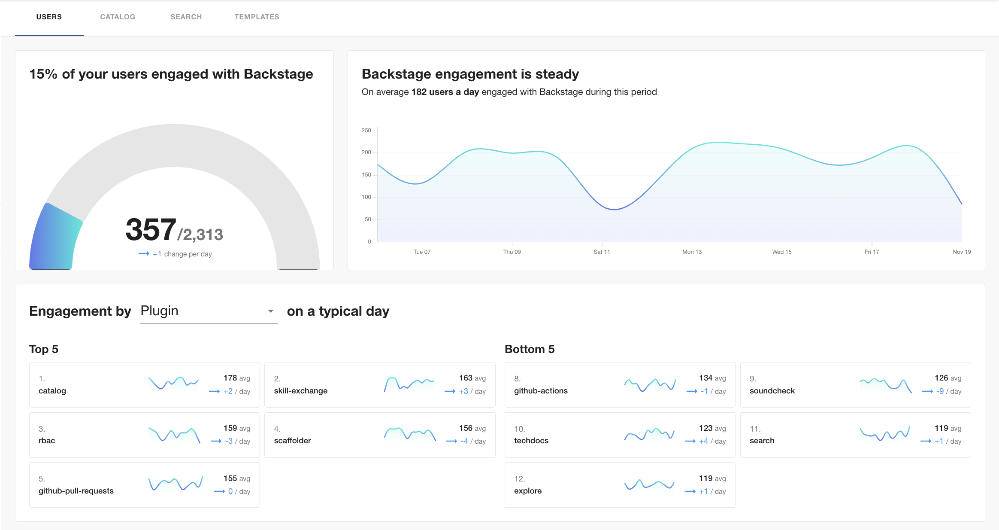

## Filtering

Global filters allow you to refine your data search based on specific criteria. You can choose from a range of period filters, with data available for up to 90 days in the past, and customize the date range to suit your needs. These filters apply to all the graphs across every tab, providing a seamless and tailored experience. With Insights filtering options, you can be precise and discover exactly what you’re looking for with out-of-the-box and customly defined dimensions on user and entity data.

## Users

The Users page in the Insights plugin shows general user activity in Backstage by highlighting total active users (TAU), daily active users (DAU), and daily active users segmented in three different charts. This feature is built for the Backstage champion (e.g. Developer Experience Lead, Director of Platform, Staff/Principal Engineer) that is looking to onboard other teams into Backstage and drive widespread adoption at your organization.

### Use Cases

- **Share Success with Leadership:** The Users page is a great entry point for leadership, especially those responsible for the overall investment in your Backstage program. This view gives a quick overview of the crucial first step in Backstage success at your company: adoption.

- **User Onboarding:** The Users page feature can help the Backstage champion onboard new users into their Backstage instance. By providing insights on TAU, DAU, and daily active users segmented in different charts, the Backstage champion can track user activity and engagement. This information can be used to identify areas where the team(s) driving adoption may need additional support or training, ensuring a smooth onboarding process.

- **User Engagement Analysis:** Track DAU and monitor trends in user activity to assess user engagement. Champions can identify any drops or spikes in engagement and investigate the reasons behind them. This analysis can help improve the user experience, identify areas of improvement, and take appropriate actions to boost user engagement.

- **Performance Evaluation:** Measure the performance of your Backstage app by monitoring the total active users over time. This information can be used to measure growth and adoption, and evaluate the effectiveness of initiatives aimed at increasing user participation and to make data-driven decisions for future improvements.

- **Resource Allocation:** Data from the Users page can assist in resource allocation decisions by providing insights into user activity. The Backstage champion can use the data to identify teams or departments that are highly active or less engaged. This information can help allocate resources, such as training or support, to areas that require attention or to further enhance the adoption of Backstage within the organization.

- **Benchmarking and Goal-Setting:** Set benchmarks and goals for user activity. By analyzing the charts and tracking the progress of DAU, the champion can establish realistic targets for increasing user engagement. This feature also provides a way to measure the success of initiatives aimed at achieving these goals.

Note: For all the pages, the selected period can be between any two dates up to a maximum of 90 days into the past.

### Total Active Users (TAU)

The TAU visualization displays the percentage of users who have accessed Backstage within a selected period. Note that the selected period can span any two dates, up to a maximum of 90 days in the past. This view gives you insight into your Backstage stickiness by seeing how many of your registered users are actively using Backstage.

### Daily Active Users (DAU)

The DAU chart showcases the trends in Backstage usage by visualizing the number of users who are active on a daily basis. This view helps identify patterns and gain valuable insights into user behavior over time.

### Activity by Segment

Break activity down by the default plugin and user groups or by any custom user dimension to identify how different segments are engaging with Backstage differently. Uncover the segments that are driving engagement and understand why some segments may be less active. By connecting with the less engaged segments, you can gather valuable feedback and insights to grow or incentivize their participation.

## Catalog

The Catalog page offers a granular view of Software Catalog usage data, showing the top-visited entities that have been accessed in a given period. The top-visited entities visualization ranks Catalog entities by visits. Similar to the Users page, data in the Catalog can be filtered by the out-of-the-box provided dimensions of entity kind, lifecycle, namespace, owner, and type, but also any custom entity dimensions that have been configured.

### Use Cases

- **Unleash the Potential of Your Most Popular Entities:** Identify which entities are receiving the most traffic and leverage these individuals as your champions. They are the key adopters who can inspire and influence the rest of the organization. Take the opportunity to interview these owners and understand the reasons behind their popularity.

## Search

The Search page offers a granular view of Backstage Search usage data. Data surfaced on this page includes: total searches, daily number of searches, and top search queries. Total searches show the number of searches from Backstage users in a specified period of time. The daily number of searches visualizes the number of searches over a selected period of time. Top search queries rank search queries by how often a query has been searched for over a given period of time. These views are useful for admins that are looking to identify trends and get a better understanding of what users are looking for most often.

### Use Cases

- **Evaluate Search Functionality Effectiveness:** Use Insights to gain a deep understanding of how your search feature performs within your Backstage instance. By analyzing comprehensive metrics and user behavior patterns, you can uncover invaluable data into the effectiveness of your search functionality.

- **Gain Visibility into What Users Are Looking For:** Peek into the minds of your users and gain unparalleled visibility into what they are searching for. By capturing and analyzing user search queries, you can learn and optimize search capabilities accordingly or rethink architecture and UI decisions within your Backstage instance. For example, if the highest volume of search queries is for a specific plugin, that's a good signal it should be more visible on the sidebar.

- **Assess Impact of Changes or Improvements:** Measure the success of your search feature enhancements by comparing search data from different periods. Our comprehensive analytics reports allow you to assess the impact of changes or improvements, empowering you to make data-driven decisions for continuous optimization.

- **Track Daily Count of Searches:** Quantify the popularity and usage of your search feature with real-time data tracking. Our advanced analytics engine provides you with daily metrics on the number of daily searches, giving you a pulse on user engagement and search trends.

### Total Searches

Track the daily count of searches performed by users. This data provides valuable insights into the popularity and usage of the Backstage Search feature. Use this information to understand if users are actively utilizing the search functionality to discover new content.

### Daily Number of Searches

Evaluate the effectiveness of your search functionality with insightful data. Understand how many people use Backstage for search purposes over a specific time period. Use the date picker to indicate the desired timeframe and compare it with the previous period.

### Top Search Queries

Gain visibility into what people are searching for and optimize your search capabilities

 accordingly. Identify if your search is optimized and ensure that users can find the content they are looking for. Analyze patterns and tailor your search results to meet user expectations.

## Templates

Stay informed about your team's Software Template usage. Track the overall count of template usage, daily trends, and the templates that your team relies on the most.

These features are designed to benefit both template owners, who can assess their template's usage, and Backstage admins or champions, who can evaluate the comparative usage of different templates.

### Use Cases

- **Template Usage Analysis:** Assess the adoption and popularity of specific templates by tracking overall usage.

- **Comparative Usage Evaluation:** Evaluate the usage of different templates to identify the most relied-upon ones.

- **Template Optimization:** Optimize templates based on usage data to meet user needs effectively.

