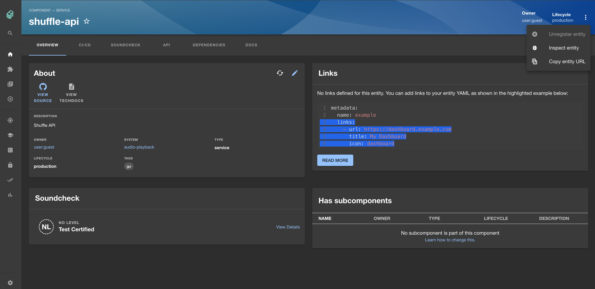

## Introduction

Backstage provides a powerful platform for managing catalogs, but in some scenarios, you may want to restrict users from deleting entities they don't own from the catalog. This tutorial guides you through the process of setting up a conditional check using Role-Based Access Control (RBAC) to determine if a user should be able to delete a catalog entity. With this rule, users will only be able "Unregister entities" (delete) for those in which they are an owner.

 

> Example: `catalog.entity.delete` (Unregister entity) is disabled in the above screen shot

### Prerequisites

- Access to Backstage and RBAC with administrative privileges.

## Steps

> For this tutorial, we'll be using the `any-allow` [decision resolution strategy](/spotify-for-backstage-docs/rbac/core-concepts#decision-resolution-strategy) which is the default setting for RBAC

### 1. Duplicate existing RBAC policy

Start by duplicating your current RBAC policy by clicking "Duplicate" in the policy card.

### 2. Add a "Default user" role

Create a new role specifically for default users.

- In the **Roles** card, click "+ NEW ROLE".
- Name the new role "Default user"

### 3. Assign members to the "Default user" role

The the default setting when creating a new role will apply it to ALL members. You will see "All" in the **Members** card. For this step, no further action is required.

### 4. Enable catalog read permissions

We are going to enable catalog entity read permissions:

- In the **Permission Decisions** card and select "NEW PERMISSION DECISION"
- In the modal, select "CHOOSE A SPECIFIC PERMISSION"
- In the **Permission name** dropdown select "catalog.entity.read"
- Set the decision to "ALLOW"
- Click "SAVE"

### 5. Conditionally allow catalog delete permissions

We are going to all catalog entity deletion IF the user is an owner of the catalog entity:

- In the **Permission Decisions** card and select "+ NEW"
- In the modal, select "CHOOSE A SPECIFIC PERMISSION"
- In the **Permission name** dropdown select "catalog.entity.delete"
- Set the decision to "CONDITIONAL"
- In the new modal click "ADD" and select "Condition"
- In the **Rule** dropdown select "IS_ENTITY_OWNER"
- Click the checkbox "Use the claims from the logged in users token"
- Click "SAVE"

### 7. Go back to the policy overview

- Click "BACK TO POLICY" to view the list of roles.

> For simplicity and the purposes of this tutorial, we have deleted all other roles.

### 8. Save and Publish

Save and publish the updated RBAC policy to make it effective.

- Click the `...` next to the **SAVE** button.
- Select "Save & publish" from the dropdown menu.

Congratulations! Your Backstage policy is now live. Try this out by navigating to a entity you DO NOT own and attempt to delete it from the catalog (top right ellipses of an entity's page) and you should see a `DISABLED` "Unregister Entity" option. Then try navigating to an entity you DO own and check the same where the "Unregister Entity" will be `ENABLED`.
