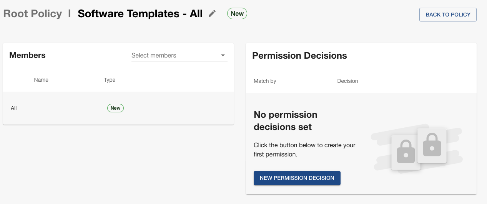
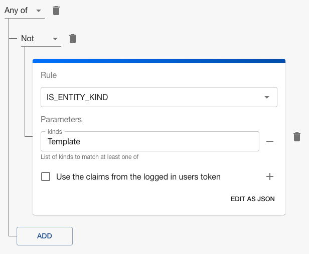
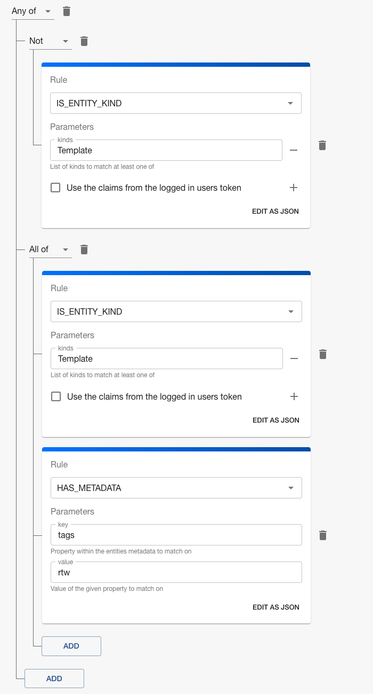
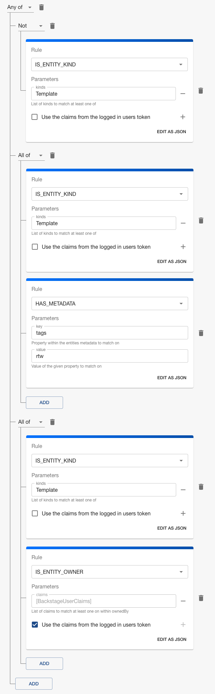
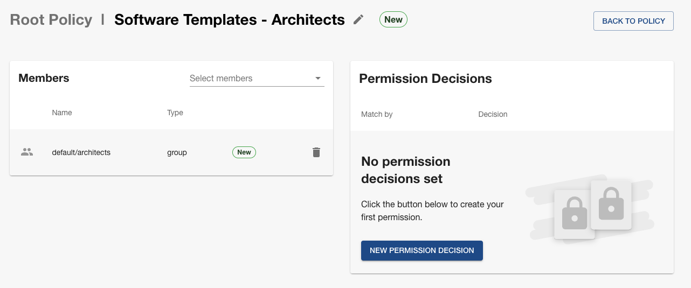
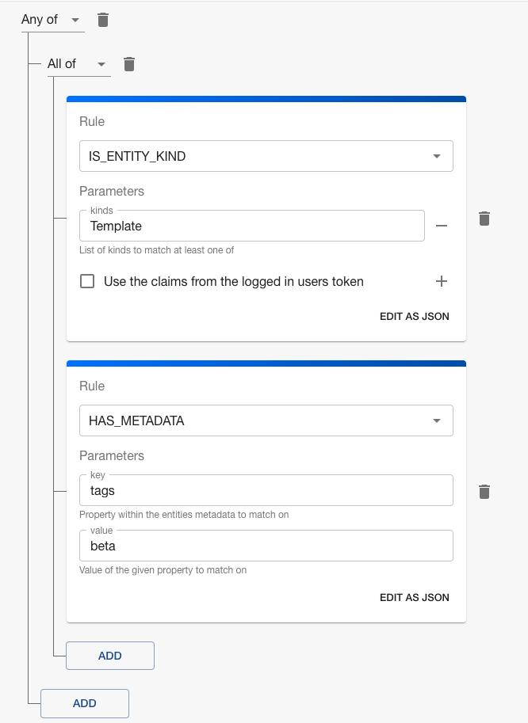

## Introduction

Backstage's core feature, [Software Templates](https://backstage.io/docs/features/software-templates/), enables the creation of new software components through a user-friendly, wizard-like interface. Often you want to restrict the use of a specific template due to infrastructure they create or the template itself being in active development. This tutorial guides you through the process of securing your templates along with how to promote templates as they are being developed using Role-Based Access Control (RBAC).

### Scenario

For this tutorial we have the following scenario:

- We have four templates, three are owned by one group (Team A), and the fourth is owned by another (Team B)
- Each of the templates owned by Team A has one of the following three tags - "alpha", "beta", "ga" (General Availability) - respectively
- The template owned by Team B has the "beta" tag
- There is a group called Architects that contains members of the Architecture Team

### Goal

The goal of this tutorial is to use RBAC to grant all Backstage users the ability to use Software Templates with the "ga" tag, restrict the usage of Software Templates with the "beta" tag to members of the Architects group, and allow any team that owns a Software Template to use it, regardless of its tags.

### Prerequisites

- Access to Backstage and RBAC with administrative privileges.
- Using the `any-allow` [decision resolution strategy](/spotify-for-backstage-docs/rbac/core-concepts#decision-resolution-strategy) which is the default setting for RBAC.

## Steps

In the following steps we are using a policy called "Root Policy", your policy name may differ.

### 1. Duplicate Existing RBAC Policy

To preserve your existing roles and permissions, start by duplicating your current RBAC policy.

### 2. Add a "Software Templates - All" Role

Create a new role specifically for managing access to Software Templates.

- In the **Roles** card, click "+ NEW ROLE"
- Name the new role "Software Templates - All"
- Members section will stay as is, showing "All"

The role should look like this:

### 3. Apply Permission Decisions to "Software Templates - All" Role

We need to apply a complex conditional Permission Decision to be able to reach the goal of this tutorial. [Conditional decisions](https://backstage.io/docs/permissions/concepts#conditional-decisions) allow you to authorize based on characteristics of entities like Software Templates.

- In the **Permission Decisions** card, click "+ NEW"
- In the modal, keep the default "CHOOSE A SPECIFIC PERMISSION"
- Select "catalog.entity.read" from the **Permission name** dropdown
- Then click "CONDITIONAL", this will cause the screen to change
- Now click "ADD" and select "Any of"
- Next click the "Trash can" icon to delete the empty **Rule** card
- Click "ADD" and select "Not"
- Then click "ADD" again and select "Condition"
- For this first rule select "IS_ENTITY_KIND" and then enter "Template" in the text box that says **kinds**

At this point the **Permission Decision** should look like this:

- Click "ADD" again but this time select "All of"
- This **Rule** card will be exactly like the one we just created; select "IS_ENTITY_KIND" and then enter "Template" in the **kinds** textbox
- Then click "ADD" right under the card you just created and select "Condition"
- For this new **Rule** card, select "HAS_METADATA" and then under **Parameters** for the **key** enter "tags" and for the **value** enter "ga"

Now the **Permission Decision** should look like this:

- At this point you will have two (2) "ADD" buttons, click on the second one at the bottom and select "All of"
- This **Rule** card will be exactly like the one we just created meaning select "IS_ENTITY_KIND" and then enter "Template" in the text box that says **kinds**
- Then click "ADD" again and select "Condition"
- In this **Rule** card select "IS_ENTITY_OWNER" and then check "Use the claims from the logged in users token"
- Click the "SAVE" button

The completed **Permission Decision** should look like this:

### 4. Add a "Software Templates - Architects" Role

The role we've just built allows owners to read their own templates, and allows anyone to read templates tagged with "ga". We now need to add a new role to allow members of the Architect group to read templates tagged with "beta".

- In the **Roles** card, click "+ NEW ROLE"
- Name the new role "Software Templates - Architects"
- In the **Members** card click on the "Select members" dropdown
- Under the "GROUPS" heading check or select "default/architects"

The role should look like this:

### 5. Add Permission Decision to "Software Templates - Architects" Role

We need to add a conditional Permission Decision to the "Software Templates - Architects" Role.

- In the **Permission Decisions** card, click "+ NEW"
- In the modal, keep the default "CHOOSE A SPECIFIC PERMISSION"
- Select "catalog.entity.read" from the **Permission name** dropdown
- Then click "CONDITIONAL", this will cause the screen to change
- Now click "ADD" and select "Any of"
- For this first Rule select "IS_ENTITY_KIND" and then enter "Template" in the text box that says **kinds**
- Click "ADD" again but this time select **Condition**
- For this first Rule select "HAS_METADATA" and then under **Parameters** for the **key** enter "tags" and for the **value** enter "beta"
- Click the "SAVE" button

The completed **Permission Decision** should look like this:

### 7. Save and Publish

Save and publish the updated RBAC policy to make it effective.

- Click the ellipsis next to the **Save** button.
- Select "Save and publish" from the dropdown menu.

Congratulations! Your Backstage Software Templates are now secured and can be safely promoted to a wider audience as they are ready.