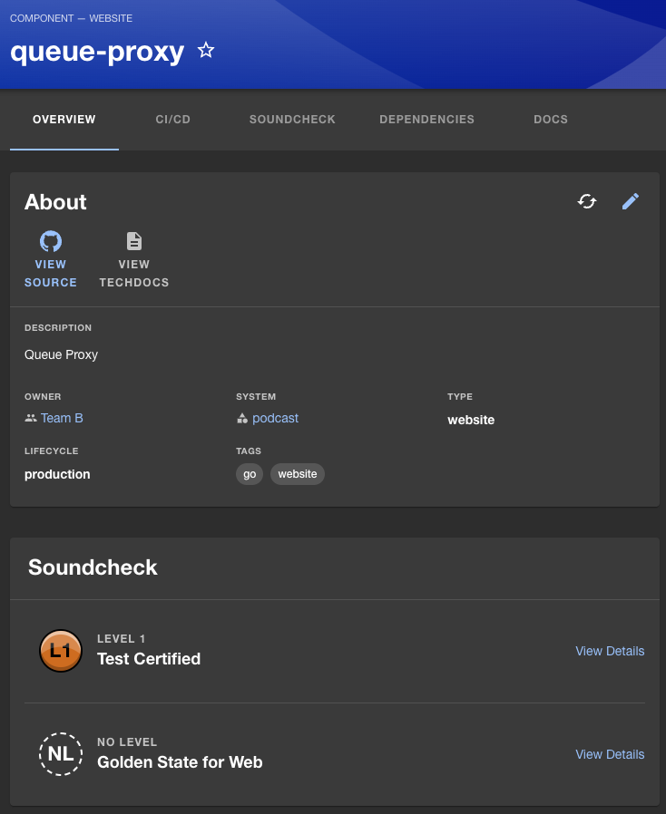
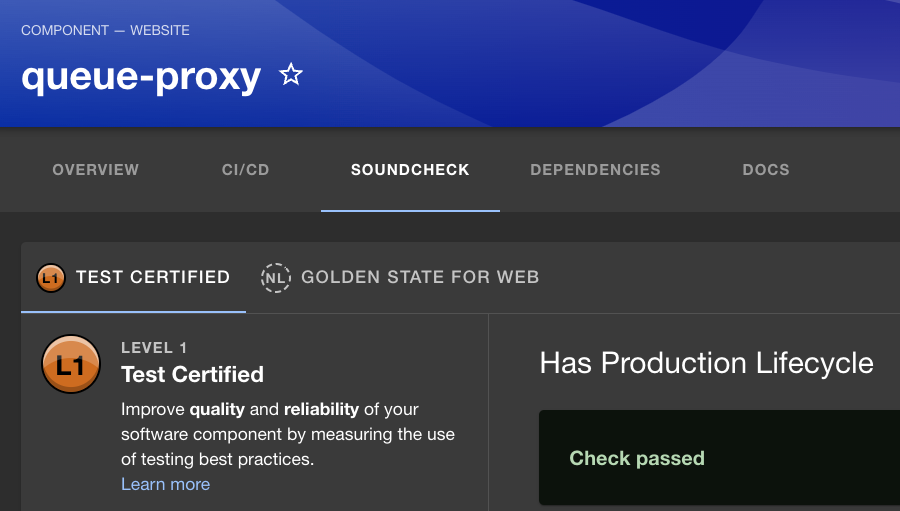

The Soundcheck Entity Card is an element of the Soundcheck plugin that provides a quick view
of an entity's technical health as defined by the Tracks that apply to the entity. The
Entity Card is found on the entity's overview page in Backstage:

In the sample image above, the Soundcheck Entity Card shows the sample 'Queue-Proxy' entity's badge
levels for the 'Golden State for Web' track and the 'Test Certified' track. Clicking on a Track's
'View Details' link will take you to the entity's Soundcheck tab with the corresponding
track tab selected:

Note: The Soundcheck Tab must be setup for the Soundcheck Entity Card to be displayed.

For more information see the Soundcheck
[Entity Tab](/soundcheck/soundcheck-elements/soundcheck-entity-tab)
section of this guide.