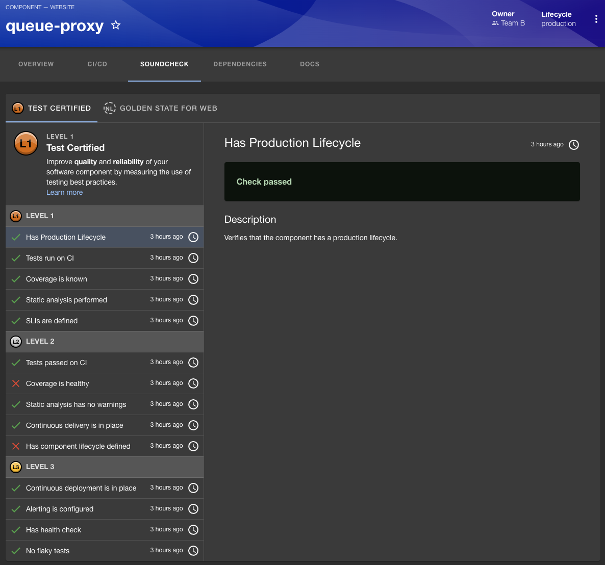

The Soundcheck Entity Tab is an element of the Soundcheck plugin that provides a detailed view
of an entity's technical health as defined by the Tracks and Checks that apply to the entity. The
Entity Tab is found on the entity's overview page in Backstage:

In the sample image above, the Soundcheck Entity Tab is shown for the sample entity 'Queue Proxy',
and we can see that there are two tracks which apply to the entity: the 'Test Certified' and 'Golden
State for Web' tracks. Let's take a closer look at the 'Test Certified' track:

The 'Test Certified' track has achieved the level one badge, and we can easily see the checks that
make up the levels of this Track, along with their statuses and the last time each check was
performed against this entity. Selecting a check will display the details of the check on the right
side of the page, we can see in the image above that the 'Has Production Lifecycle' check is
passing, and was checked about three hours ago.

Notice that all the checks in level three of this Track are passing, but because two checks in level
two have failed, the entity is only certified at level one.

For more information on Checks, Tracks, and Levels, see the corresponding sections in the Soundcheck
[Core-Concepts](/category/core-concepts)
section of this guide.