This guide provides instructions on how to use Soundcheck and is aimed at individual contributors
(IC) who are interested in assessing the technical health of their team.

Whether you're an IC seeking to see how your team's technical health is holding up as a whole or you
just want to assess the technical health of a single component, Soundcheck has you covered.

## The Tech-Health Page: An Overview

The Tech-Health page provides a high-level overview of the technical health of your organization.
It can be accessed by clicking the Tech-Health tab after navigating to Soundcheck:

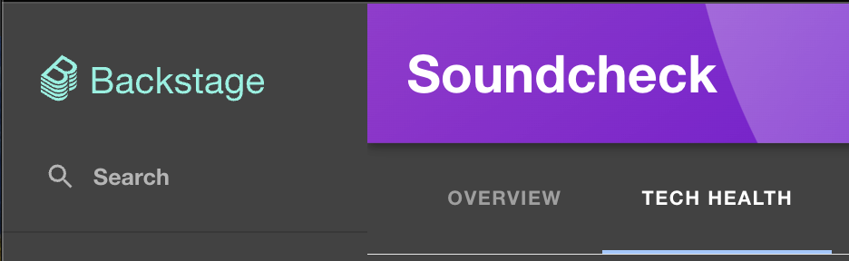

The Tech-Health page contains six sub-tabs, each of which provides a different view of the data:

- [Summary](#summary-tab)
- [Entities](#entities-tab)
- [Checks](#checks-tab)
- [Teams](#teams-tab)
- [Tracks](#tracks-tab)
- [Campaigns](#campaigns-tab)

Each of the Tech-Health tabs has a shared filter section on the left-hand side of the page. We'll
start by covering how filters work to get specific data, then we'll show how each of the sub-tabs
can be used to view the filtered data to assess your team's technical health.

## Filtering Data

Let's take a look at the Soundcheck Tech-Health filter section:

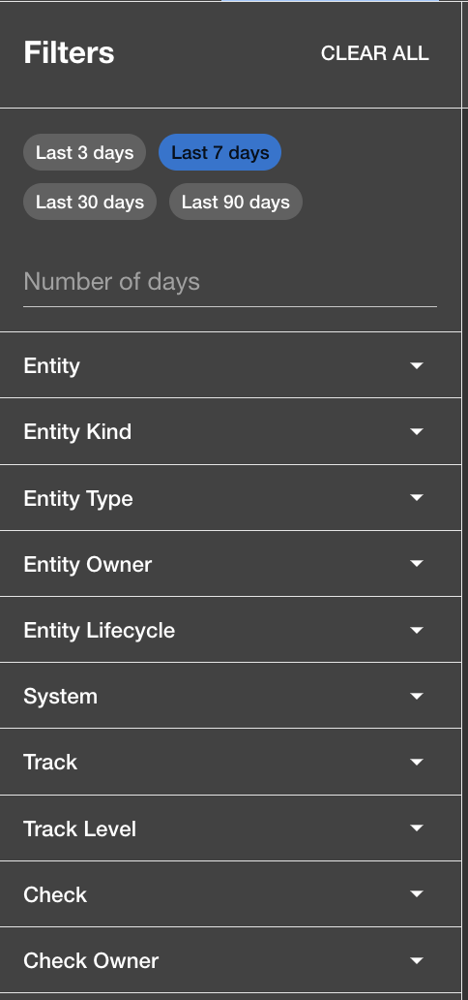

Each of the filters is described below, but first note the following key concepts:

***Key Concepts:***
 - *When a filter is changed, Soundcheck data is immediately updated to
reflect only that data that passes the filters.*
 - *Different filters are cumulative, each one can be read as "AND". For example, a team filter
combined with a track filter would be read "I want to see results for this team AND this track".*
 - *Filters support multiple selections. You're not limited to a single team, track, check, etc. You
can select as many as you like.*

### Filters:
  - Number of Days: The number of days of data to include in the charts. The default is 7 days.
  - Entity: Filter the entities for which they want to see data.
  - Entity Kind: Filter by entity kinds, such as 'Component', 'System', 'API',
    etc.
  - Entity Type: Filter by entity types, such as 'plugin', 'service', 'website',
    etc.
  - Entity Owner: Filter results to only those entities owned by the specified users.
  - Entity Lifecycle: Filter by entity lifecycle, such as 'production', 'staging',
    'experimental', etc.
  - System: Filter by systems, which are compositions of entities.
  - Track: Filter by tracks, which are compositions of levels and checks.
  - Track Level: Filter by track levels, which are compositions of checks.
  - Check: Filter by specific checks.
  - Check Owner: Filter by check owners.

Now let's look at the Summary tab, which by default provides a high-level overview of the tech
health of your organization, but which we'll filter to a specific team to simulate an IC examining
their team's technical health.

## Applying Your Team Filter

Applying a team filter will ensure that the data you see is applicable to just your team. To do
this, click the 'Entity Owner' filter, and select your team from the list of available teams. On
this page, we'll use Team-B as our example team:

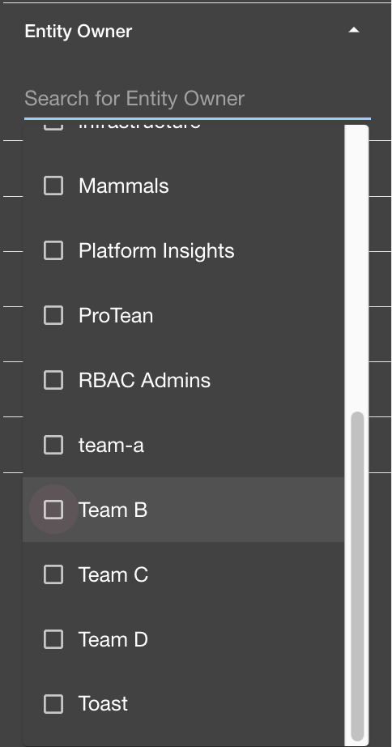

Once you've selected your team, the filter will reflect that selection:

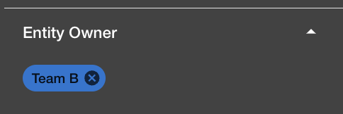

The charts will update, and are now filtered to only show data for Team-B! Now that we've filtered,
let's go through each of the charts and tabs to see how they can be used to assess your team's tech.

## Summary Tab

The summary tab contains four charts that, when filtered to your team, provide a high-level overview
of your team's technical health. Let's look at each chart in turn.

### Check Pass Rate Chart

The (filtered) Check Pass Rate chart shows aggregate pass rate for all entities owned by your team.

The chart comprises two views, a snapshot view and a trend view. The snapshot view shows the latest
pass rate, while the trend view shows the pass rate over time:

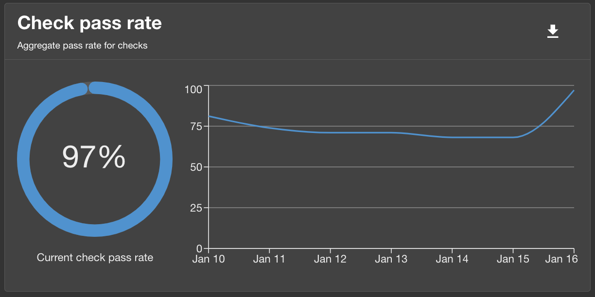

In the image above, the snapshot view shows that the team's latest pass rate is 97%, while the trend
view shows the pass rate as it has changed over the last seven days.

### Track Pass Rate Chart

Like the Check Pass Rate chart, the (filtered) Track Pass Rate chart shows how your team's entities
are doing in terms of tracks, broken down by track level. This char too shows both a
snapshot view on the left and a trend view on the right:

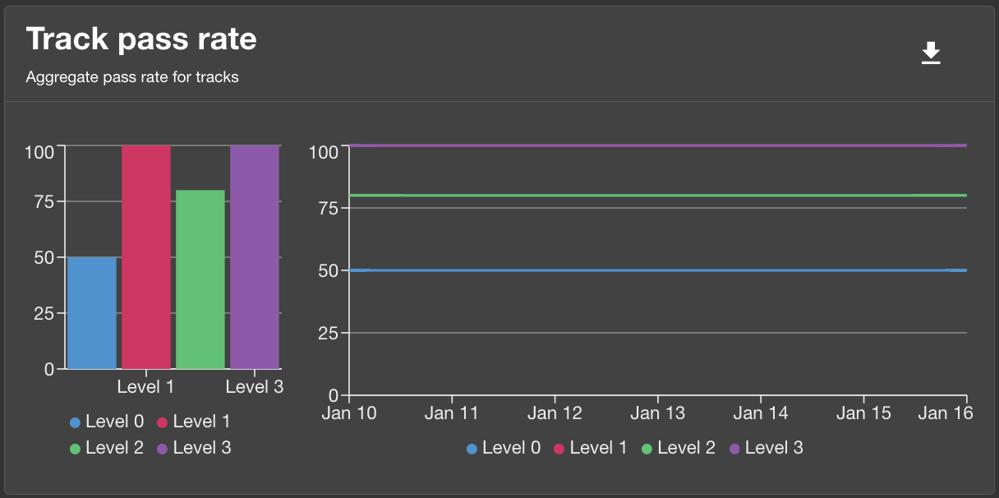

### Entity Pass Rate Chart

The (filtered) Entity Pass Rate chart shows the passing percentage trend of the top 5 entities owned
by your team:

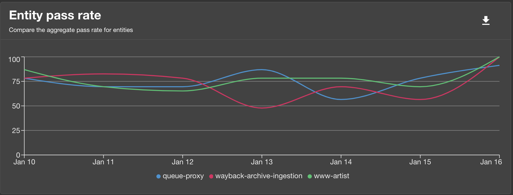

### Team Pass Rate Chart

Finally, the (filtered) Team Pass Rate chart shows the latest passing percentage of your team
(filtered thusly, the data is redundant with the snapshot overall pass rate of the first chart):

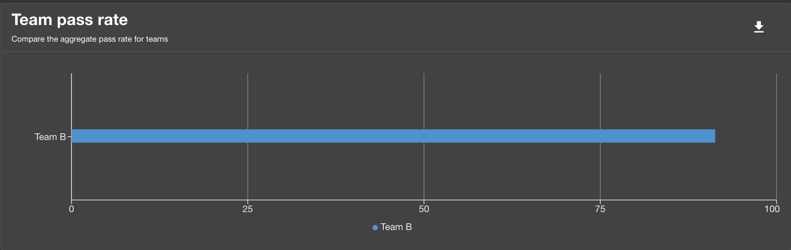

## Use Cases

Now that we've seen how the Summary tab provides a high-level overview of your team's technical health,
let's look at some use cases to see how Tech-Health can be used to get more specific metrics on your
team, and how each Tech-Health tab can provide a different perspective over the data.

### Use Case 1: How is my team doing on a specific track?
As a team member, you want to see how well your team is adopting/adhering to a given track.
With your team filter in place, add in a track filter by selecting the track you're interested in
under the 'Track' filter section. The charts will immediately update, showing results filtered to
only include checks that are part of the selected track:

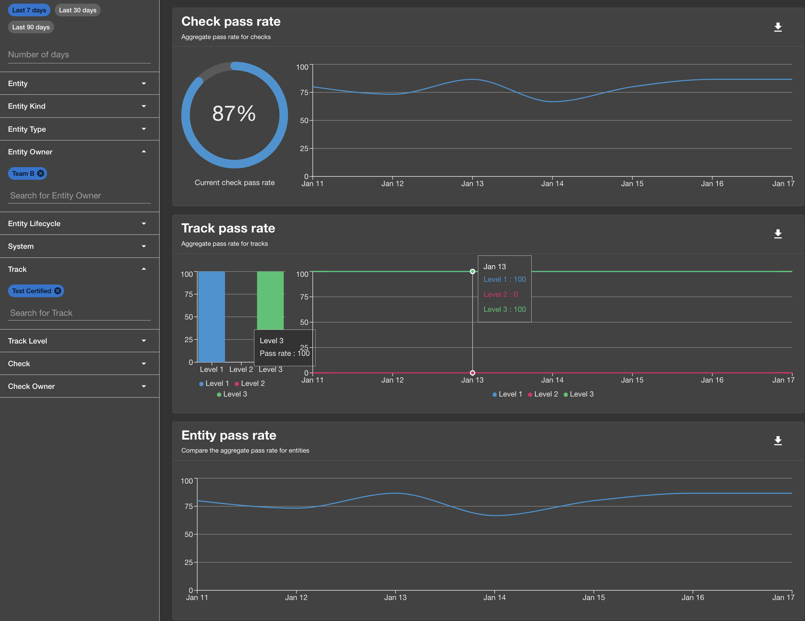

Above, the check pass rates, track pass rates, and the entity pass rate charts are all updated to
reflect only the status of the 'Test Certified' as it pertains to those entities owned by Team-B.

### Use Case 2: How are my team's systems?
Your team owns one or more systems, and you want to see how a specific system is doing in terms of a
specific technical health objective. You can do this by additionally filtering the data to only include
the system in question as well as specifying which track (technical health objective) you want to assess.

In the example there is a system called the 'podcast', owned by Team-B. Let's say you want to see
how this system is doing in terms of the 'Golden State for Web' track. First, you would select the
'podcast' system under the 'System' filter, and then the 'Golden State for Web' track under the
'Track' filter, leaving the team filter in place:

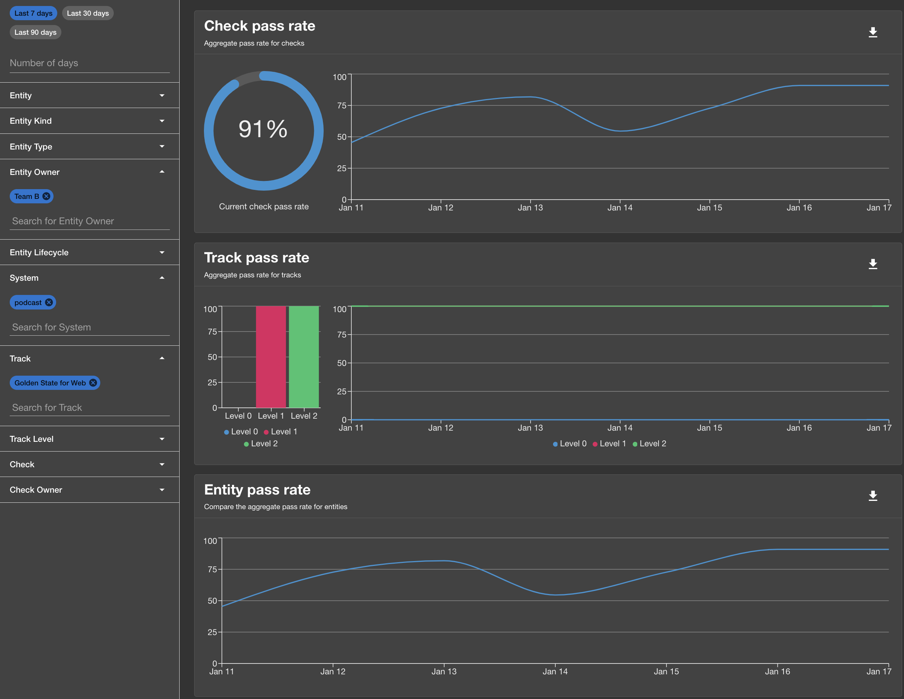

Voiila! The charts are now updated to show only the data for the 'podcast' system,
and only for the 'Golden State for Web' track, and only for entities owned by Team-B.

Team-B's podcast system is doing well, with a 100% pass rate for the 'Golden State for Web' track on
levels 1 and 2, but is falling short on level 0.

### Use Case 3: How is my team doing on some specific checks?
For our final IC use case, say you want to check how your team's entities are doing against a
specific set of checks. Select the checks under the 'Check' filter, leaving your team filter in
place, and the charts will update to show only the pass rate data relevant to those checks for your
team. The summary page will show the overall pass rate:

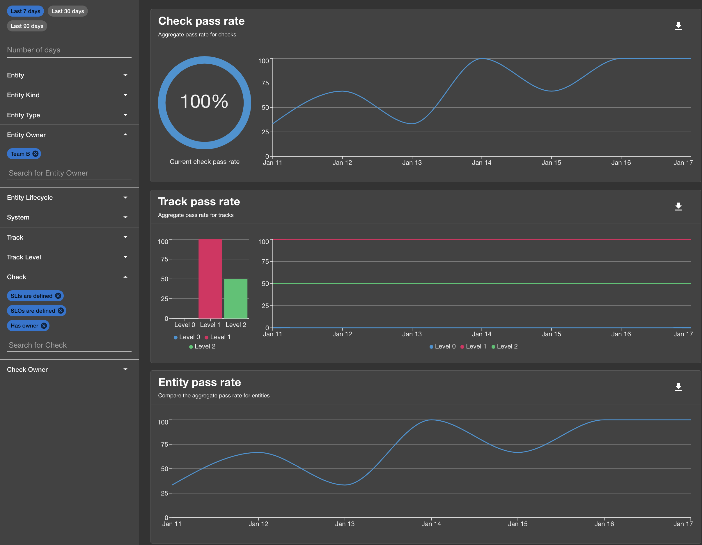

## Other Tech-Health Tabs

So far we've focused on the Summary tab, which provides an aggregated view of the data. Let's now
cover the other tabs, which provide more granular views.

### Checks Tab
The Checks tab shows the pass rates for individual checks. Below, three checks have been selected
with a filter for Team-B, to show how all entities owned by Team-B are doing on those checks:

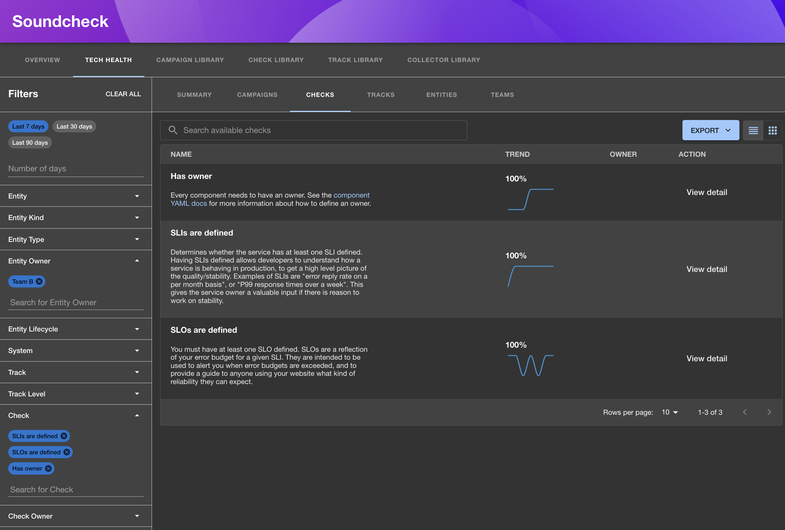

#### Tracks Tab
The Tracks tab shows the pass rates for individual tracks, filtered here for Team-B:

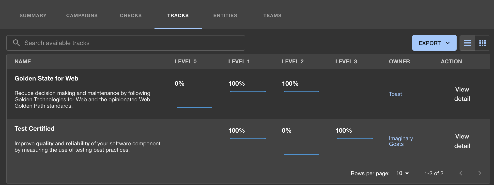

This shows the pass rates of each level of each track against all entities owned by Team-B.

#### Entities Tab
The Entities tab shows the pass rates for individual entities, filtered here for entities owned by
the ACME-Corp team:

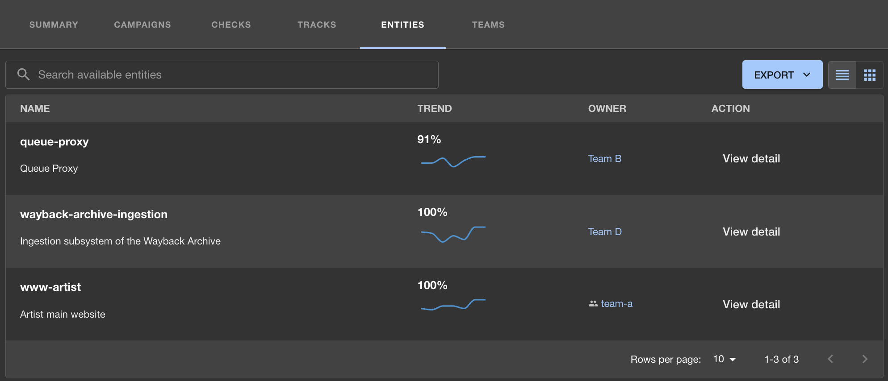

#### Teams Tab
The teams tab shows the pass rates for individual teams, filtered here for a few sample teams:

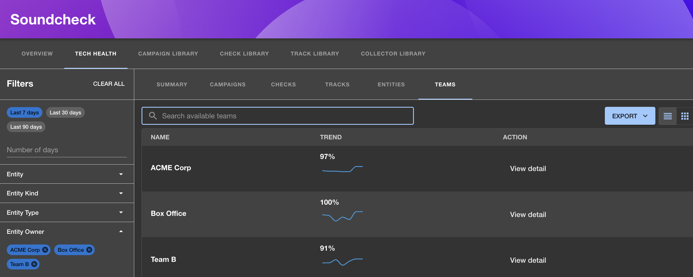

The data shows the pass rates for each team for checks against all entities owned
by each team.

## Summary

We've seen how the Summary tab can be filetered to provide a high-level overview of your team's tech
health, and how additional filters can be added to drill down into the data to assess your team's
technical health in terms of specific tracks, systems, teams, checks, and more. The Summary tab is a
great place to start when you want to get a quick overview of your team's technical health, and the
filters provide the ability to quickly get the data you need. The other tabs in Tech-Health provide
additional ways to view the data, broken down by entity, check, teams, and tracks.

## What's Next

[Additional Documentation](https://www.npmjs.com/package/@spotify/backstage-plugin-soundcheck?activeTab=readme#soundcheck-tech-health-page)
