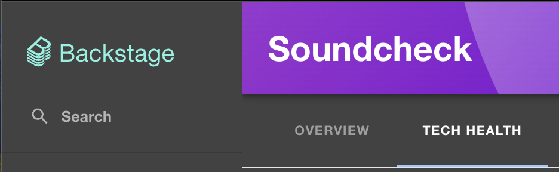
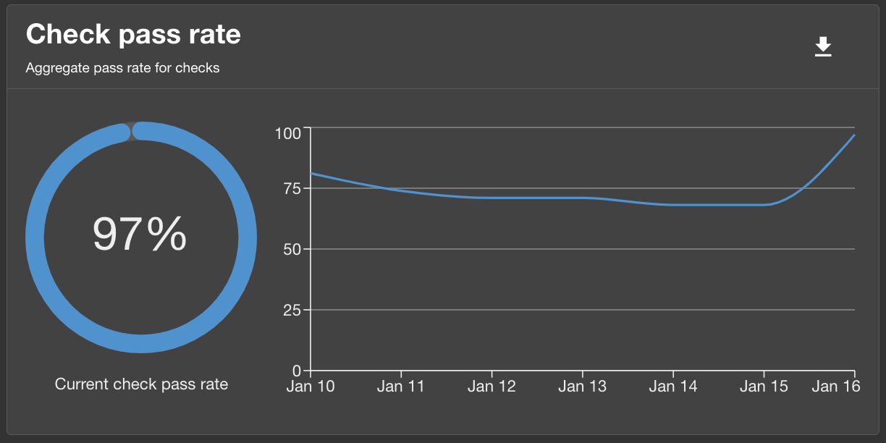
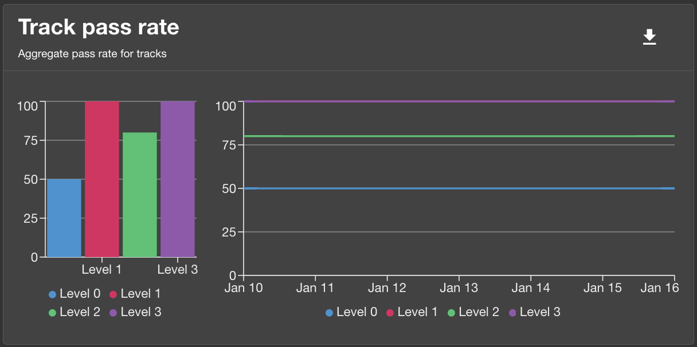
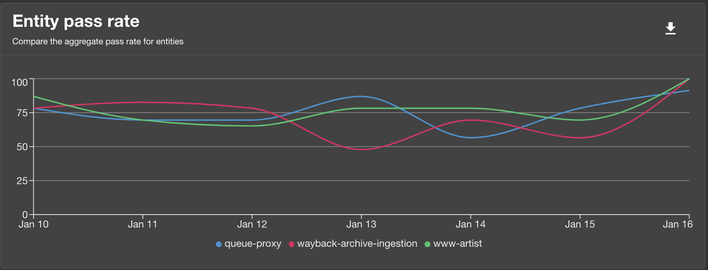
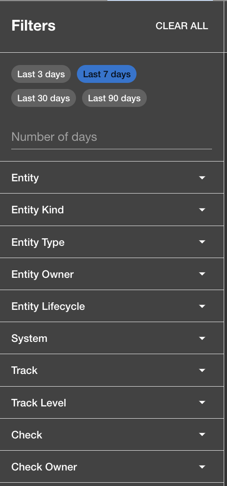

This guide provides instructions on how to use Soundcheck and is aimed at higher-level users like
project managers and organizational leaders. It offers an overview covering the basics of using the
Soundcheck Tech-Health Summary tab as well as the use of the Summary tab's filters, such as
searching for specific metrics and trends.

Whether you're a team leader seeking to see how your team's technical health is holding up or an
organization leader looking to assess a specific technical health objective, this guide will equip
you with the necessary knowledge get the Soundcheck metrics you need quickly and easily.

## The Tech-Health Page: An Overview

The Tech-Health page provides a high-level overview of the technical health of your organization. It's a
great place to start if you're looking to get a quick overview of your organization's check and track
pass and fail rates, as well as the pass and fail rates of specific systems, teams, and more.

The Tech-Health page is accessed by clicking the Tech-Health tab after navigating to Soundcheck:

The Tech-Health page contains six sub-tabs, but we'll focus on the Summary tab in this guide.

The Summary tab provides a one-stop-shop for getting a high-level overview of your organization's
technical health while providing drill-down capabilities to get to more granular data.

## Summary Tab

The summary tab contains four charts that provide a high-level overview of your organization's tech
health, as well as a set of filters that allow you to quickly customize the data
displayed in the charts. The filters are described in detail in the
[Filters](#filters) section.

Let's look at each chart to get an idea of what they show and their purpose.

### Check Pass Rate

The Check Pass Rate chart shows the passing percentage of all checks in your organization against
all entities. Unfiltered, it is the aggregation of all of your Soundcheck's most recent data.

The chart comprises two views, a snapshot view and a trend view. The snapshot view shows the latest
pass rate, while the trend view shows the pass rate over time:

In the image above, the snapshot view shows that the latest pass rate is 97%, while the trend view
shows the pass rate as it has changed over the last seven days (the timeline is adjustable, more on
that in the filters section).

### Track Pass Rate

Like the Check Pass Rate chart, the unfiltered Track Pass Rate chart shows the passing percentage of
all tracks against all entities in your organization, broken down by track level, and shows both a
snapshot view on the left and a trend view on the right:

### Entity Pass Rate

The unfiltered Entity Pass Rate chart shows the passing percentage trend of the top 5 entities in
your organization (note that the test data in the sample image below contains only three entities):

### Team Pass Rate

Finally, the unfiltered Team Pass Rate chart shows the latest passing percentage of up to five teams
of which the logged-in user is a member:

## Filtering Data

So far, we've covered the Summary tab and its four charts with their default behavior, which gives a
high-level overview of your organization's technical health at a glance. Now, we'll switch focus and show
how to drill down into the data to quickly get more granular results. This filtering is the key to
getting the data you need and one of the primary use cases of the Summary tab for organizational
leaders and managers. Note however that the filters are available on all tabs, and work in the same
way.

Let's take a look at the filter section:

Each of the filters is described briefly below, but first note the following key concepts:

***Key Concepts:***
 - *When a filter is changed, Soundcheck data is immediately updated to
reflect only that data that passes the filters.*
 - *Different filters are cumulative, each one can be read as "AND". For example a team filter combined with
a track filter would be read "I want to see results for this team AND this track".*
 - *Filters support multiple selections. You're not limited to a single team, track, check, etc. You can
select as many as you like.*

### Filters:
  - Number of Days: The number of days of data to include in the charts. The default is 7 days.
  - Entity: Filter the entities for which they want to see data.
  - Entity Kind: Filter by entity kinds, such as 'Component', 'System', 'API',
    etc.
  - Entity Type: Filter by entity types, such as 'plugin', 'service', 'website',
    etc.
  - Entity Owner: Filter results to only those entities owned by the specified users.
  - Entity Lifecycle: Filter by entity lifecycle, such as 'production', 'staging',
    'experimental', etc.
  - System: Filter by systems, which are compositions of entities.
  - Track: Filter by tracks, which are compositions of levels and checks.
  - Track Level: Filter by track levels, which are compositions of checks.
  - Check: Filter by specific checks.
  - Check Owner: Filter by check owners.

## Use Cases

### Use Case 1: How can I assess the technical health of a specific track?
As an organizational leader, you want to see the overall adoption/adherence to a given track.
First, sdelect the track you're interested in under the 'Track' filter. The charts will update,
showing results filtered to only include checks that are part of the selected track:

Above, check pass rates, track pass rates, and the entity pass rate charts are all updated to reflect
only the status of the 'Test Certified' track.

### Use Case 2: How can I assess the technical health of a specific system?
Say you're a project manager, and you want to see how a specific system is doing in terms of a specific
technical health objective. You can do this by filtering the data to only include the system in question
as well as specifying which track (technical health objective) you want to assess.

In the test data there is a system, 'artist-engagement-portal', which for demonstration purposes
contains only a single entity, but which in practice could comprise tens or hundreds of entities.
Let's say you want to see how this system is doing in terms of the 'Test Certified' track.
First, you would select the 'artist-engagement-portal' system under the 'System' filter, and then
the 'Test Certified' track under the 'Track' filter:

Voilà! The charts are now updated to show only the data for the 'artist-engagement-portal' system,
and only for the 'Test Certified' track:

With the filter specified, what you'll now see is the total check pass rate and track pass rates,
but only for those entities that belong to the 'artist-engagement-portal' system, and only those
checks that are part of the 'Test Certified' track.

The artist-engagement-portal system is doing great! It has a 100% pass rate for the 'Test Certified' track.

### Use Case 3: How can I assess the technical health of a specific team?

In our next example, let's say you're a team leader, and you want to see how your team is doing in
terms of a few targeted tracks. Easy enough, first select your team under the 'Team' filter, and
then select the tracks in which you're interested under the 'Track' filter:

Not bad! The data is now filtered to only show checks that apply to entities owned by 'Team-B', and
only those checks that are part of the 'Test Certified' track. Clearly there's an issue with checks
in level two of the track, but the team is doing great on levels one and three.

### Use Case 4: How can I assess the technical health of a specific check?
Finally, say there is a particular set of checks that you're interested in, and you want to see how
they're doing across your organization. Select the checks under the 'Check' filter, and the charts will
update to show only the pass rate data relevant to those checks. The summary page will show the
overall pass rate:

However, let's suppose you want to see the pass rate per check. Switch to the "Checks" tab, and you'll
see the pass rate for each check individually:

> Note that when switching tabs, the filters remained in place and applied to both tabs.

## Summary

We've seen how the Summary tab provides a high-level overview of your organization's technical health,
and how the filters can be used to drill down into the data to assess the technical health of specific
tracks, systems, teams, checks, and more. The Summary tab is a great place to start when you want to
get a quick overview of your organization's technical health, and the filters provide the ability to
quickly get the data you need. The other tabs in Tech-Health provide additional ways to view the
data, broken down by entity, check, team, tracks, and campaigns.

## What's Next

[Additional Documentation](https://www.npmjs.com/package/@spotify/backstage-plugin-soundcheck?activeTab=readme#soundcheck-tech-health-page)
